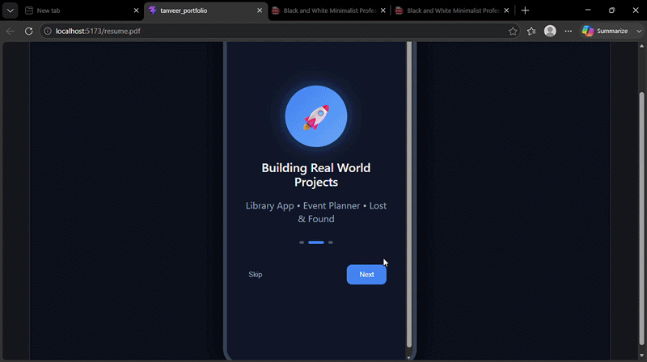

# 🌐 My Developer Portfolio

This is my personal **Android Developer Portfolio Website** built using **React.js**.  
It showcases my skills, projects, achievements, and experience in mobile app development.

---

## 👩‍💻 About Me

Hi! I am **Tanveer Kaur**, an Android Developer passionate about building modern, scalable, and user-friendly mobile applications using **Kotlin, Jetpack Compose, and Firebase**.

---

## ✨ Features

- 📌 Responsive Portfolio UI
- 👩‍💻 About Me Section
- 📂 Projects Showcase
- 🏆 Achievements & Certifications
- 💼 Experience Section
- 📞 Contact with Email & WhatsApp integration
- 🔗 GitHub & LinkedIn links

---

## 🛠️ Tech Stack

- Kotlin
- Jetpack Compose
- Andorid
- React Icons
- Firebase 
- Git & GitHub

---

## 📂 Projects Included

- TrackIt – Campus item recovery system  
- KeathAI – AI-based evaluation platform  
- Elite Event – Event management app  
- HelpHive – Donation platform  
- FocusFlow – Productivity & focus app  

---

## 🎥 Portfolio Demo




## 📬 Contact

- 📧 Email: tanusaini.jandir@gmail.com  
- 💼 LinkedIn: [My LinkedIn](https://www.linkedin.com/in/tanveer-kaur-56a188304/)  
- 🐙 GitHub: https://github.com/tanve13  

---

## 🚀 How to Run Locally

```bash
git clone https://github.com/your-username/portfolio.git
cd portfolio
npm install
npm start
